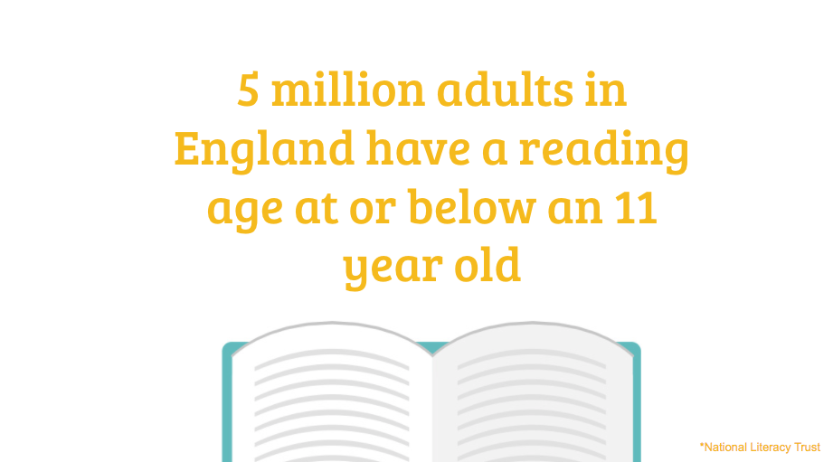
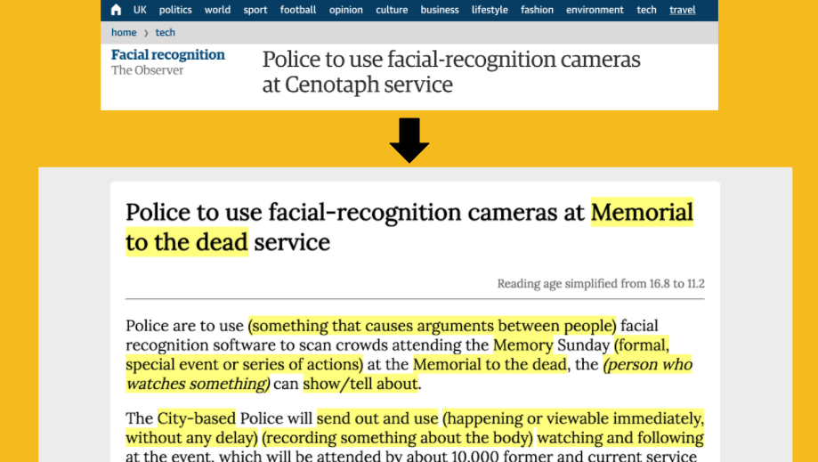

# Simple_Read

English-Simplification Chrome Extension, using [Rewordify](rewordify.com) and the Dale–Chall Readability Formula.

1st place entry in the CSS's 6-hour Accessibility Hackathon. [Presentation](https://docs.google.com/presentation/d/1I1mOKYBhCN2dEu56PWQN2moUsI95-ad7aJgZest09FY/edit?usp=sharing)

---

---

---

